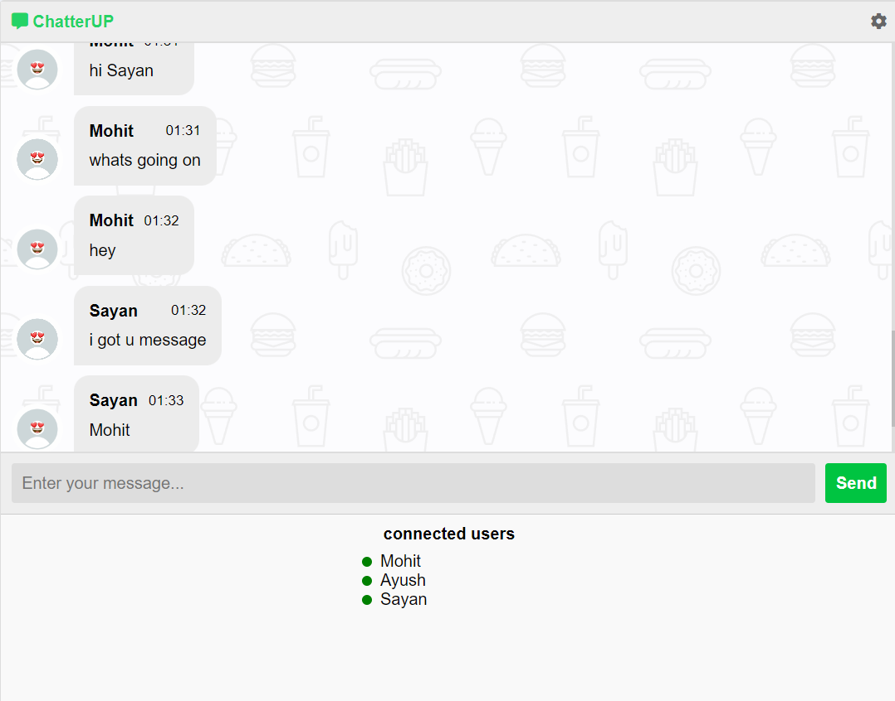
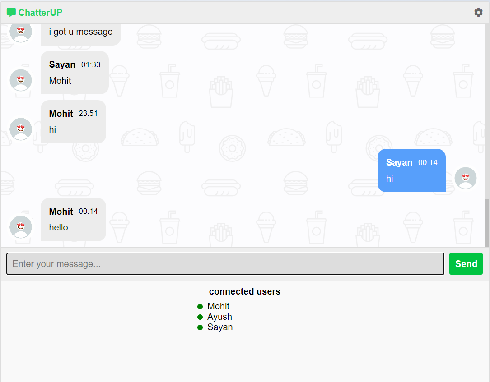

# ChaterUP

ChatterUP is a real-time chat application built with **Node.js**, **Express**, **Socket.IO**, and **MongoDB**. This app allows users to join chat rooms, send and receive messages, and view a typing indicator for active users, providing a smooth and interactive messaging experience.

## Features

- Real-time messaging using WebSockets.
- Typing indicator for active users.
- Displays a list of connected users.
- Persistent message storage with MongoDB.
- Responsive user interface.

## Getting Started

### Prerequisites

Ensure to have the following software installed:

- **Node.js** (v14 or later)
- **npm** (Node Package Manager)
- **MongoDB** (local or cloud instance)

### Installation

1. **Clone the repository:**

   git clone https://github.com/Mohit-coder75/ChaterUP.git

### UI

